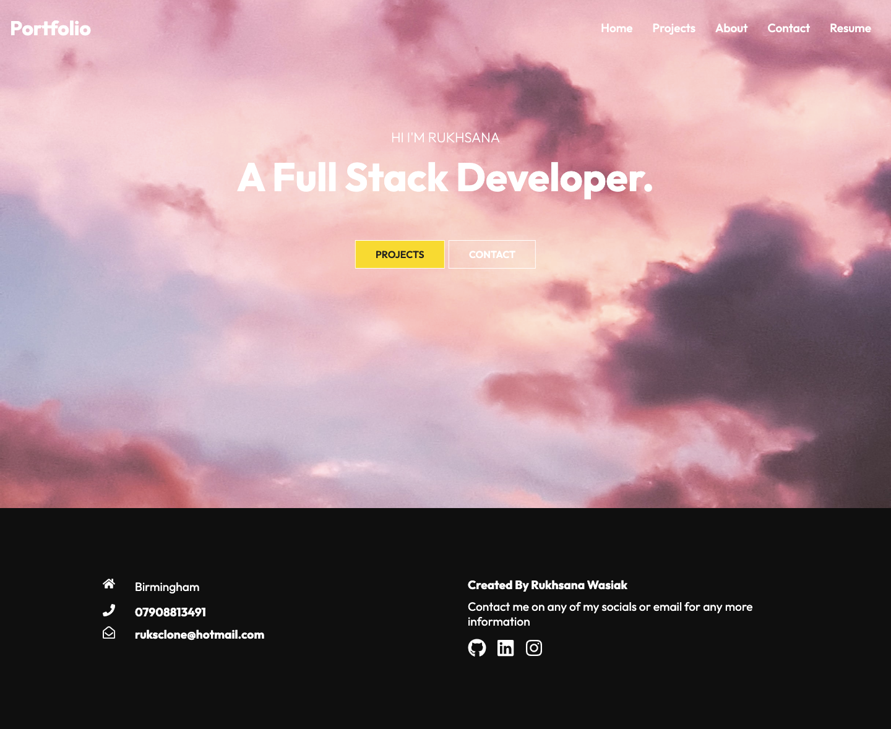
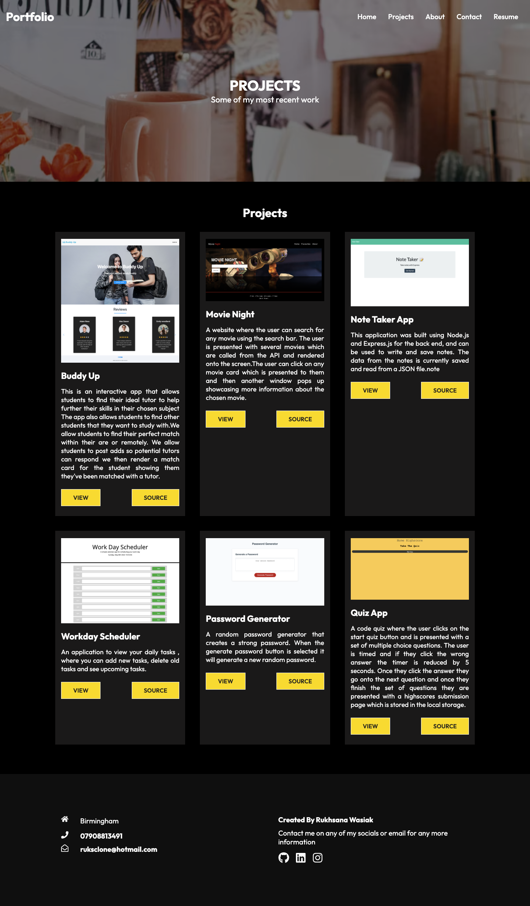
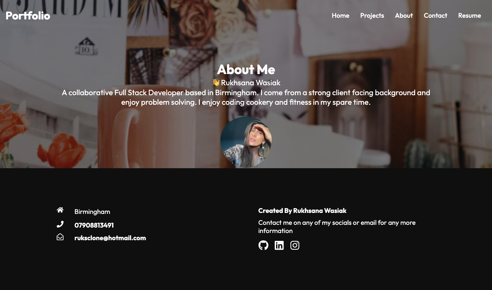
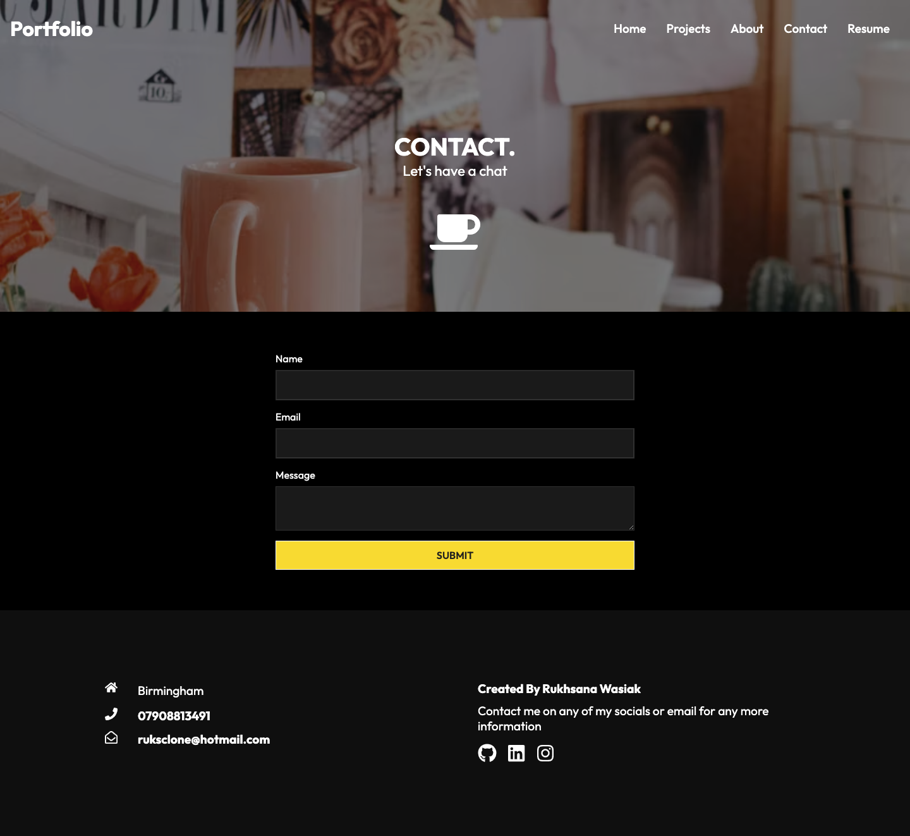
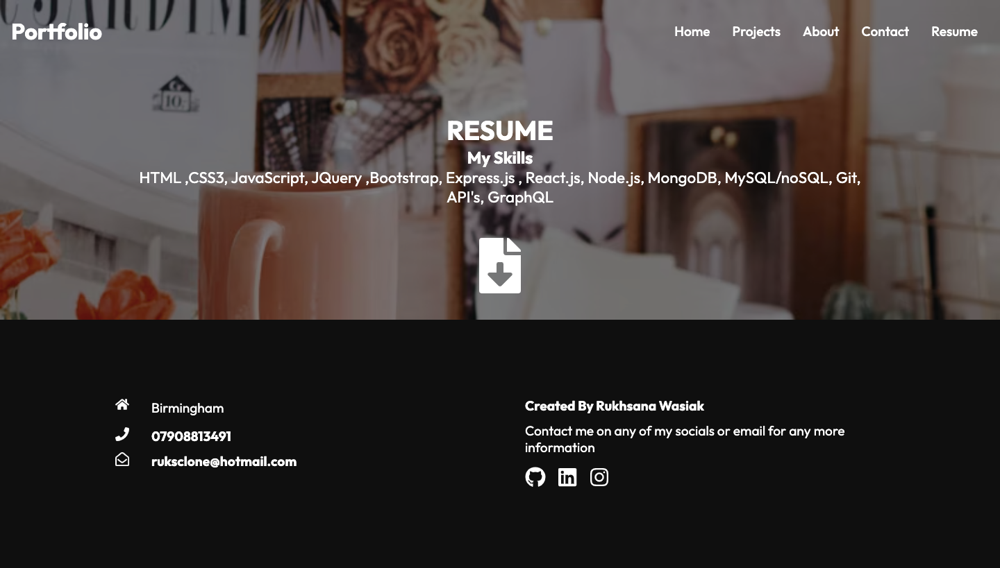

# React-Portfolio | Rukhsana Wasiak

## Description 📕

I have built my portfolio using React to showcase my projects I have completed during my coding bootcamp.
There are several components which are used throughout the application.

## Technologies 🔍

- React
- Emailjs
- React-router-dom
- CSS
- HTML
- JavaScript

## Getting Started 🚀

```
git clone git@github.com:roxywasiak/react-portfolio.git
npm i
npm run start
```

## Screenshots 📸











## View The project 👀

Click [here]() to view the project.

## Contact ✋

Contact me [HERE](mailto:ruksclone@icloud.com)
